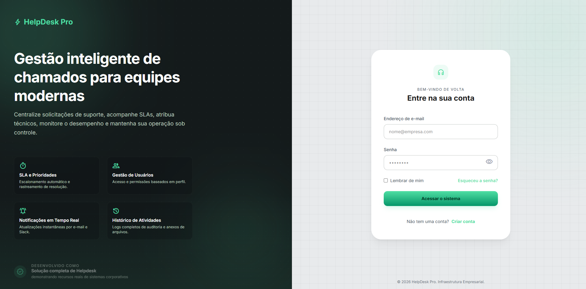
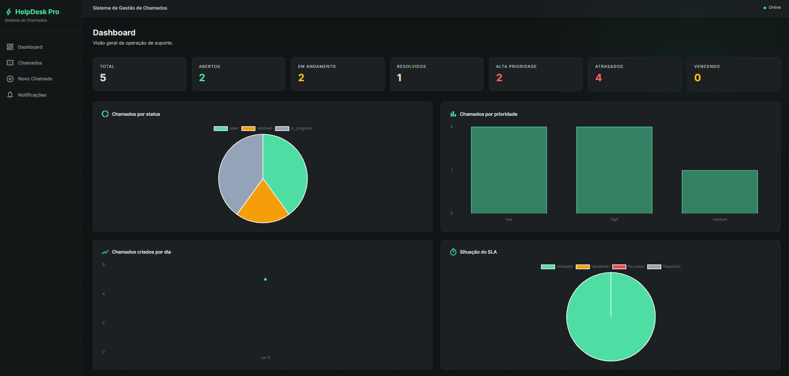
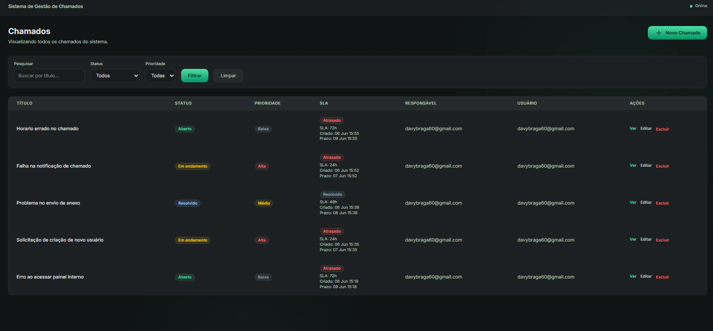
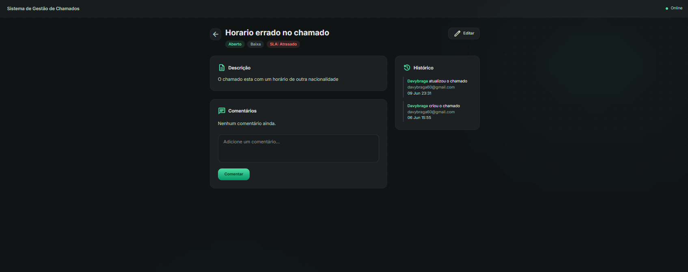
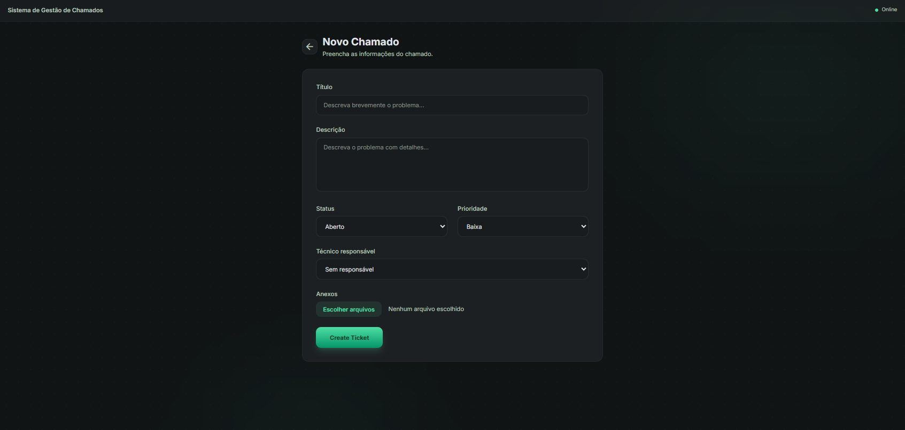
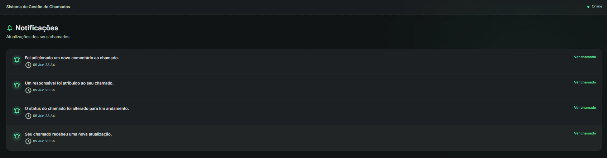

# HelpDesk Pro

Sistema de gestão de chamados de suporte com dois perfis de acesso (usuário e admin), SLA automático por prioridade, comentários, anexos, histórico de atividades, notificações internas e dashboard com gráficos.

---

## Stack

Ruby on Rails 8.1 · PostgreSQL · Tailwind CSS · Hotwire/Turbo · Devise · Active Storage · Chartkick + Chart.js

---

## Screenshots

### Login


### Dashboard


### Lista de chamados


### Detalhes do chamado


### Novo chamado


### Notificações


---

## Como rodar

```bash
git clone https://github.com/DavyPereira/helpdesk_pro.git
cd helpdesk_pro
bundle install
rails db:create db:migrate
bin/dev
```

Acesse em `http://localhost:3000`.

---

## API REST

Autenticada por token (`Authorization: Token SEU_TOKEN`).

| Método | Endpoint              | Descrição           |
|--------|-----------------------|---------------------|
| GET    | `/api/v1/tickets`     | Lista chamados      |
| GET    | `/api/v1/tickets/:id` | Exibe um chamado    |
| POST   | `/api/v1/tickets`     | Cria um chamado     |
| PATCH  | `/api/v1/tickets/:id` | Atualiza um chamado |
| DELETE | `/api/v1/tickets/:id` | Remove um chamado   |

```bash
curl -H "Authorization: Token SEU_TOKEN" http://localhost:3000/api/v1/tickets
```

O token é gerado automaticamente no cadastro do usuário.

---

## SLA

O prazo é definido automaticamente no momento da criação do chamado conforme a prioridade:

| Prioridade | Prazo |
|------------|-------|
| Alta       | 24h   |
| Média      | 48h   |
| Baixa      | 72h   |

O status do SLA é recalculado em tempo real: **no prazo**, **vencendo** (menos de 12h), **atrasado** ou **resolvido**.

---

Desenvolvido por [Davy Pereira](https://github.com/DavyPereira).
